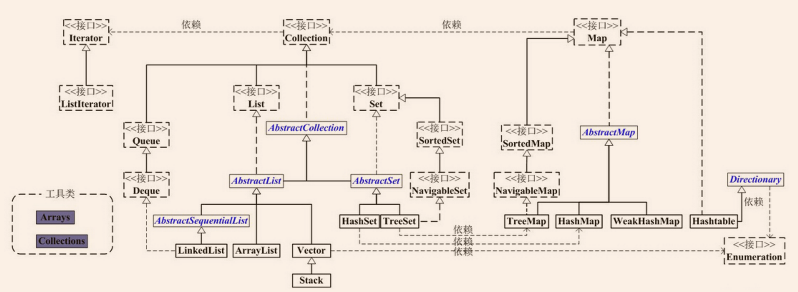

Java集合工具包位于Java.util包下，包含了很多常用的数据结构，如数组、链表、栈、队列、集合、哈希表等。学习Java集合框架下大致可以分为如下五个部分：List列表、Set集合、Map映射、迭代器（Iterator、Enumeration）、工具类（Arrays、Collections）。

Java集合类的整体框架如下：

从上图中可以看出，集合类主要分为两大类：`Collection`和
`Map`。

`Collection`是List、Set等集合高度抽象出来的接口，它包含了这些集合的基本操作，它主要又分为两大部分：List和Set。

- `List`接口通常表示一个列表（数组、队列、链表、栈等），其中的元素可以重复，常用实现类为`ArrayList`和`LinkedList`，另外还有不常用的`Vector`。另外，**LinkedList还实现了Queue接口，因此也可以作为队列使用**。

- `Set`接口通常表示一个集合，其中的元素不允许重复（通过hashcode和equals函数保证），常用实现类有`HashSet`和`TreeSet`，
 - `HashSet`是通过Map中的`HashMap`实现的
 - `TreeSet`是通过Map中的`TreeMap`实现的。另外，TreeSet还实现了`SortedSet`接口，因此是有序的集合（集合中的元素要实现`Comparable`接口，并覆写`Compartor`函数才行）。

抽象类`AbstractCollection`、`AbstractList`和`AbstractSet`分别实现了`Collection`、`List`和`Set`接口，这就是在Java集合框架中用的很多的适配器设计模式，用这些抽象类去实现接口，在抽象类中实现接口中的若干或全部方法，这样下面的一些类只需直接继承该抽象类，并实现自己需要的方法即可，而不用实现接口中的全部抽象方法。

`Map`是一个映射接口，其中的每个元素都是一个key-value键值对，同样抽象类AbstractMap通过适配器模式实现了Map接口中的大部分函数，TreeMap、HashMap、WeakHashMap等实现类都通过继承AbstractMap来实现，另外，**不常用的HashTable直接实现了Map接口**，它和Vector都是JDK1.0就引入的集合类。

`Iterator`是遍历集合的迭代器（不能遍历Map，**只用来遍历Collection**），Collection的实现类都实现了iterator()函数，它返回一个Iterator对象，用来遍历集合，ListIterator则专门用来遍历List。而**Enumeration则是JDK1.0时引入的，作用与Iterator相同，但它的功能比Iterator要少，它只能再Hashtable、Vector和Stack中使用**。

`Arrays`和`Collections`是用来操作数组、集合的两个工具类，例如在ArrayList和Vector中大量调用了Arrays.Copyof()方法，而Collections中有很多静态方法可以返回各集合类的synchronized版本，即线程安全的版本，当然了，如果要用线程安全的结合类，首选首选Concurrent并发包下的对应的集合类。
