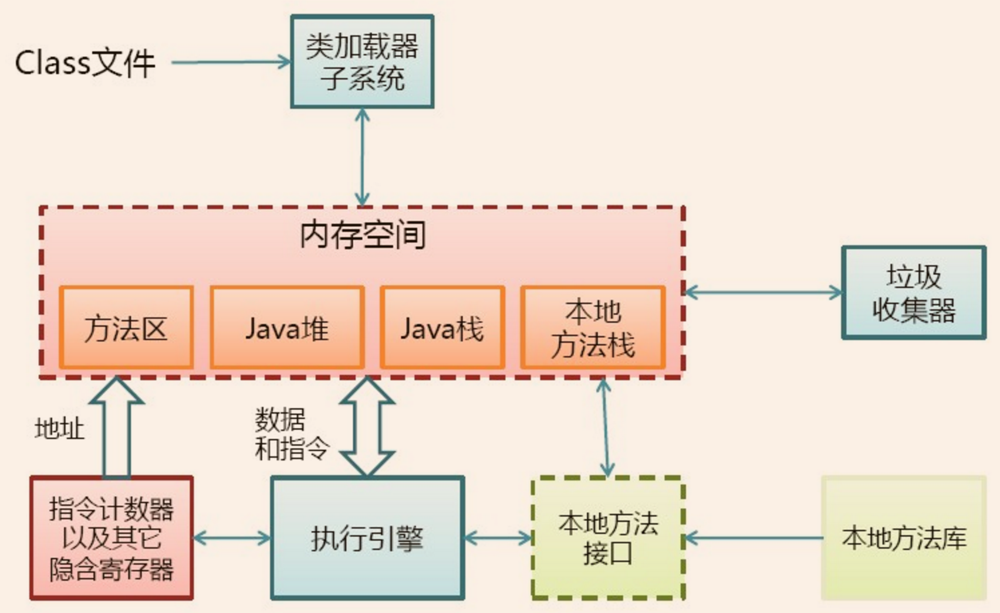
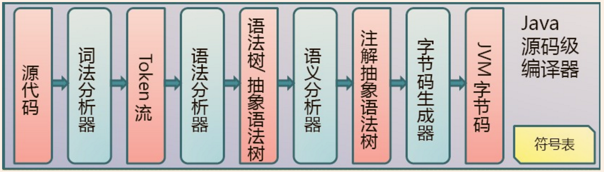
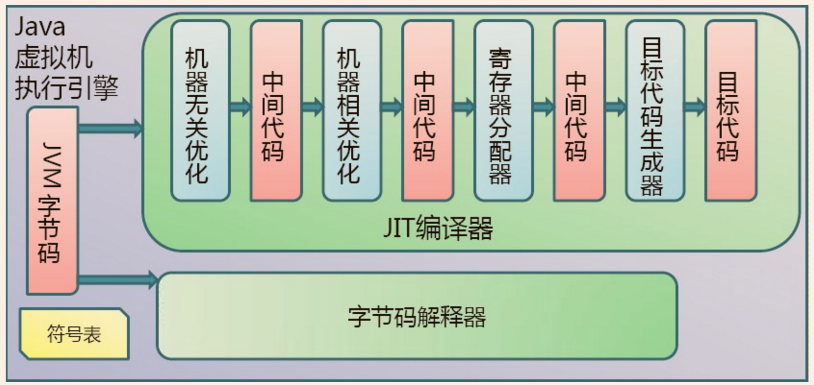
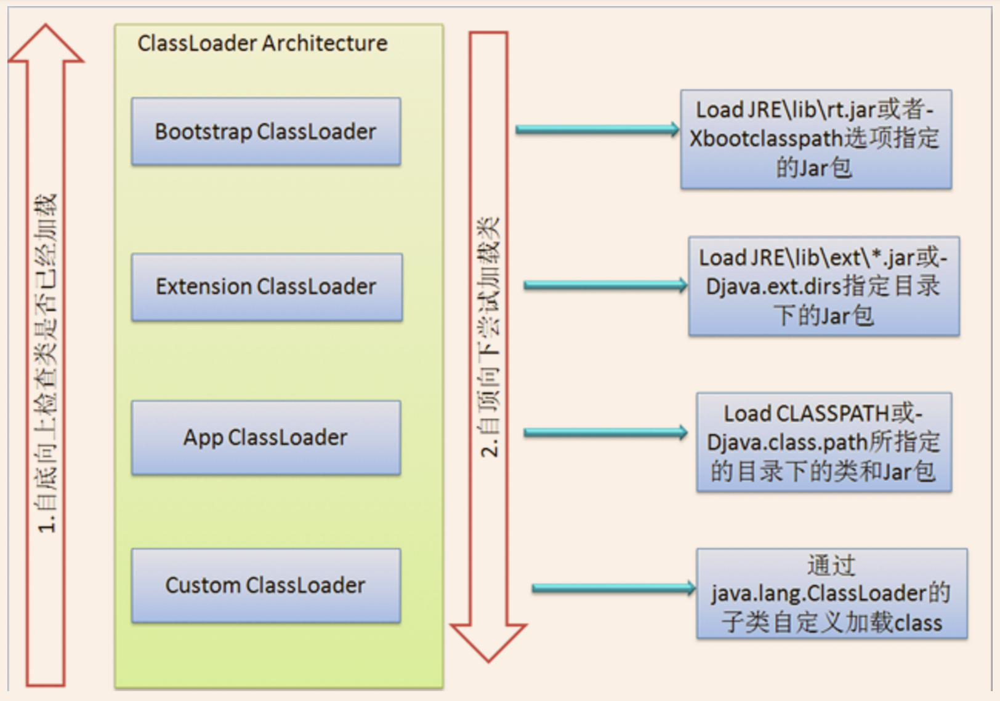
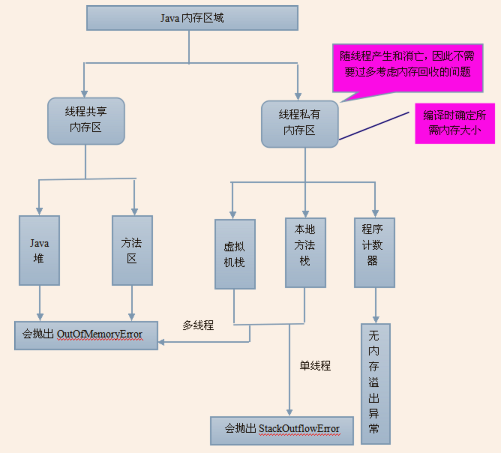
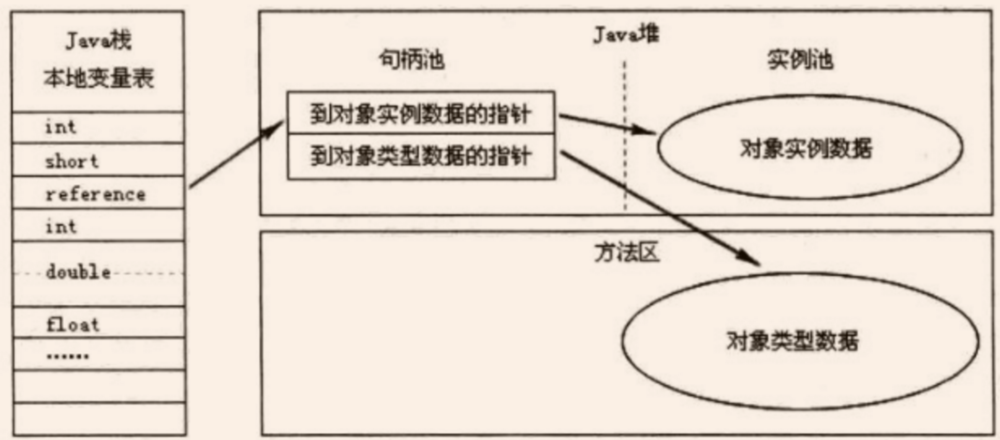
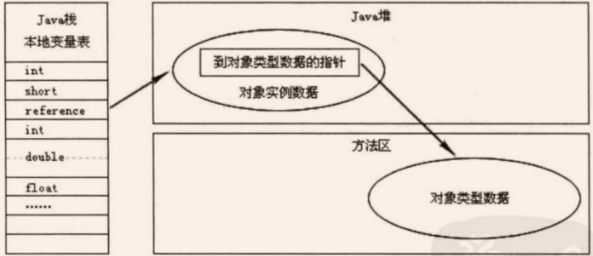
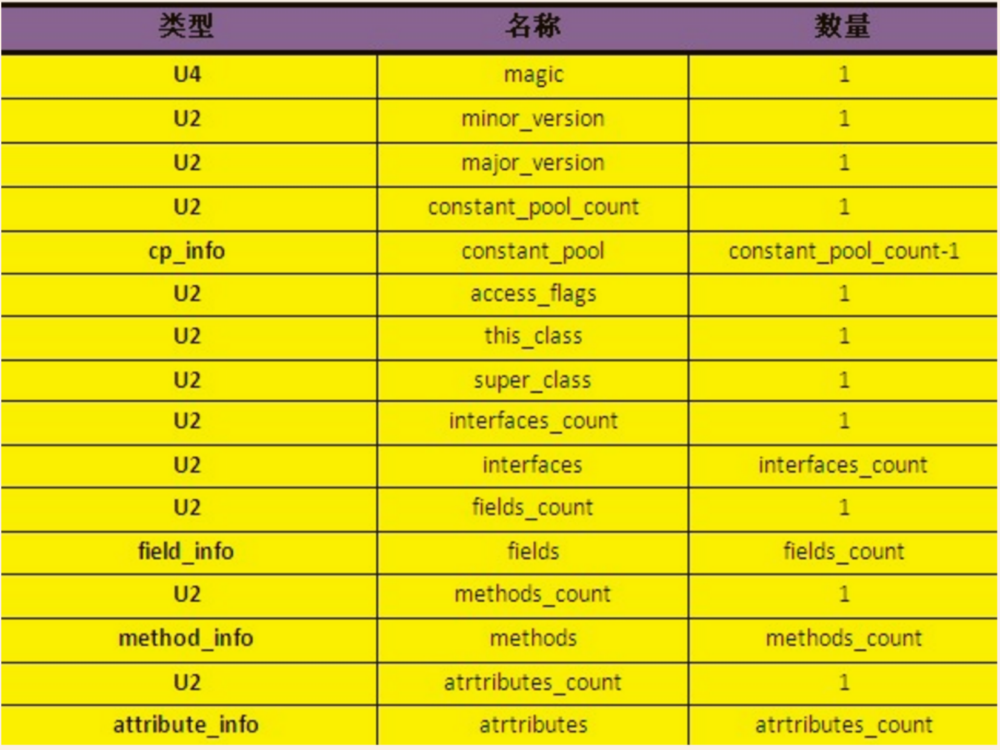
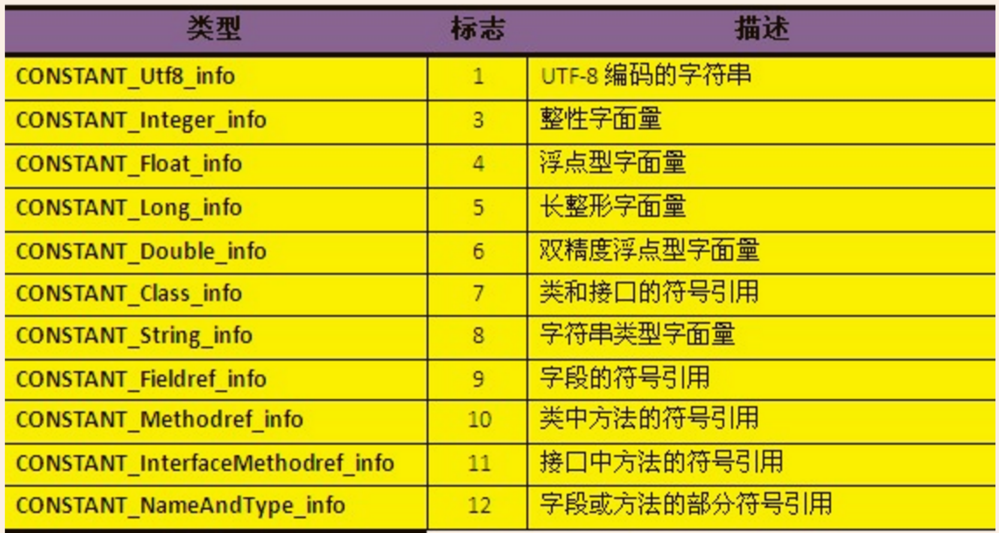

# OVerview
## Java技术体系可以分为四个平台，分别为：

- `Java Card`：支持一些Java小程序（Applets）运行在小内存设备（如智能卡）上的平台。
- `Java ME（Micro Edition）`：支持Java程序运行在移动终端（手机、PDA）上的平台，对 Java API 有所精简，并加入了针对移动终端的支持，这个版本以前称为J2ME。
- `Java SE（Standard Edition）`：支持面向桌面级应用（如 Windows 下的应用程序）的 Java 平台，提供了完整的 Java 核心 API，这个版本以前称为 J2SE。
- `Java EE（Enterprise Edition`）：支持使用多层架构的企业应用（如 ERP、CRM 应用）的 Java 平台，除了提供 Java SE API 外，还对其做了大量的扩充并提供了相关的部署支持，这个版本以前称为 J2EE。

## JVM 自身的物理结


>JVM 是 Java 的核心和基础，在 Java 编译器和 os 平台之间的虚拟处理器。它是一种基于下层的操作系统和硬件平台并利用软件方法来实现的抽象的计算机，可以在上面执行 Java 的**字节码**程序。Java 编译器只需面向 JVM，生成 JVM 能理解的代码或字节码文件。Java 源文件经编译器，编译成字节码程序，通过 JVM 将每一条指令翻译成不同平台机器码，通过特定平台运行。

---
# Java 代码编译和执行的整个过程
Java 代码编译是由 Java 源码编译器来完成

Java 字节码的执行是由 JVM 执行引擎来完成


Java 代码编译和执行的整个过程包含了以下三个重要的机制
 - Java 源码编译机制
 - 类加载机制
 - 类执行机制


## 1. Java源码编译机制
 - 分析和输入到符号表
 - 注解分析
 - 语义分析和生成class文件

最后生成的 class 文件由以下部分组成：
 - **结构信息**。包括 class 文件格式版本号及各部分的数量与大小的信息。
 - **元数据**。对应于 Java 源码中声明与**_常量_**的信息。包含类/继承的超类/实现的接口的声明信息、域与方法声明信息和常量池。
 - **方法信息**。对应 Java 源码中**_语句和表达式_**对应的信息。包含字节码、异常处理器表、求值栈与局部变量区大小、求值栈的类型记录、调试符号信息。

## 2. 类加载机制


## 3. 类执行机制
>JVM 是基于栈的体系结构来执行 class 字节码的。线程创建后，都会产生程序计数器（PC）和栈（Stack），程序计数器存放下一条要执行的指令在方法内的偏移量，栈中存放一个个栈帧，每个栈帧对应着每个方法的每次调用，而栈帧又是有局部变量区和操作数栈两部分组成，局部变量区用于存放方法中的局部变量和参数，操作数栈中用于存放方法执行过程中产生的中间结果。

----
# Java 内存区域与内存溢出
## 内存区域
Java 虚拟机在执行 Java 程序的过程中会把他所管理的内存划分为若干个不同的数据区域。Java 虚拟机规范将 JVM 所管理的内存分为以下几个运行时数据区：**程序计数器、Java 虚拟机栈、本地方法栈、Java 堆、方法区**。下面详细阐述各数据区所存储的数据类型。


### A. 程序计数器
>当线程在执行一个 Java 方法时，该计数器记录的是正在执行的虚拟机字节码指令的地址，当线程在执行的是 Native 方法（调用本地操作系统方法）时，该计数器的值为**空**。另外，该内存区域是唯一一个在 Java 虚拟机规范中没有规定任何 OOM（内存溢出：OutOfMemoryError）情况的区域。（Y）

### B. Java 虚拟机栈
>虚拟机栈描述的是 Java 方法执行的**内存模型**

每个方法被执行的时候都会同时创建一个栈帧，栈它是用于支持虚拟机进行方法调用和方法执行的数据结构。对于执行引擎来讲，活动线程中，只有栈顶的栈帧是有效的，称为`当前栈帧`，这个栈帧所关联的方法称为`当前方法`，执行引擎所运行的所有字节码指令都只针对当前栈帧进行操作。栈帧用于存储**_局部变量表_、_操作数栈_、_动态链接_、_方法返回地址_和一些额外的_附加信息_**。在编译程序代码时，栈帧中需要多大的局部变量表、多深的操作数栈都已经完全确定了，并且写入了方法表的 Code 属性之中。**因此，一个栈帧需要分配多少内存，不会受到程序运行期变量数据的影响，而仅仅取决于具体的虚拟机实现。**

在 Java 虚拟机规范中，对这个区域规定了两种异常情况：
- 如果线程请求的栈深度大于虚拟机所允许的深度，将抛出`StackOverflowError`异常。
- 如果虚拟机在动态扩展栈时无法申请到足够的内存空间，则抛出`OutOfMemoryError`异常。

这两种情况存在着一些互相重叠的地方：当栈空间无法继续分配时，到底是内存太小，还是已使用的栈空间太大，其本质上只是对同一件事情的两种描述而已。在**单线程**的操作中，无论是由于栈帧太大，还是虚拟机栈空间太小，当栈空间无法分配时，虚拟机抛出的都是 `StackOverflowError` 异常，而不会得到 OutOfMemoryError 异常。而在**多线程**环境下，则会抛出 `OutOfMemoryError` 异常。


#### 下面详细说明栈帧中所存放的各部分信息的作用和数据结构。

1. **局部变量表**<br>

 局部变量表是一组变量值存储空间，用于存放方法参数和方法内部定义的局部变量，其中存放的数据的类型是编译期可知的各种**_基本数据类型_**、**_对象引用_**（reference）和 **_returnAddress_** 类型（它指向了一条字节码指令的地址）。局部变量表所需的内存空间在**编译期间**完成分配，即在 Java 程序被编译成 Class 文件时，就确定了所需分配的最大局部变量表的容量。当进入一个方法时，这个方法需要在栈中分配多大的局部变量空间是完全确定的，在方法运行期间不会改变局部变量表的大小。

 局部变量表的容量以`变量槽（Slot）`为最小单位。在虚拟机规范中并没有明确指明一个 Slot 应占用的内存空间大小（允许其随着处理器、操作系统或虚拟机的不同而发生变化），一个 Slot 可以存放一个32位以内的数据类型：boolean、byte、char、short、int、float、reference 和 returnAddresss。reference 是对象的引用类型，returnAddress 是为字节指令服务的，它执行了一条字节码指令的地址。对于 64 位的数据类型（long和double），虚拟机会以高位在前的方式为其分配两个连续的 Slot 空间。

 虚拟机通过索引定位的方式使用局部变量表，索引值的范围是从 0 开始到局部变量表最大的 Slot 数量，对于 32 位数据类型的变量，索引 n 代表第 n 个 Slot，对于 64 位的，索引 n 代表第 n 和第 n+1 两个 Slot。

 在方法执行时，虚拟机是使用局部变量表来完成参数值到参数变量列表的传递过程的，如果是实例方法（非static），则局部变量表中的第 0 位索引的 Slot 默认是用于传递方法所属对象实例的引用，在方法中可以通过关键字“this”来访问这个隐含的参数。其余参数则按照参数表的顺序来排列，占用从1开始的局部变量 Slot，参数表分配完毕后，再根据方法体内部定义的变量顺序和作用域分配其余的 Slot。

 局部变量表中的 Slot 是可重用的，方法体中定义的变量，作用域并不一定会覆盖整个方法体，如果当前字节码PC计数器的值已经超过了某个变量的作用域，那么这个变量对应的 Slot 就可以交给其他变量使用。这样的设计不仅仅是为了节省空间，在某些情况下 Slot 的复用会直接影响到系统的而垃圾收集行为。

2. **操作数栈**<br>

 操作数栈又常被称为操作栈，操作数栈的最大深度也是在编译的时候就确定了。32 位数据类型所占的栈容量为 1,64 位数据类型所占的栈容量为 2。_当一个方法开始执行时，它的操作栈是空的，在方法的执行过程中，会有各种字节码指令（比如：加操作、赋值元算等）向操作栈中写入和提取内容，也就是入栈和出栈操作_。

 Java 虚拟机的解释执行引擎称为“基于栈的执行引擎”，其中所指的“栈”就是操作数栈。~~因此我们也称 Java 虚拟机是基于栈的，这点不同于 Android 虚拟机，Android 虚拟机是基于寄存器的。~~

 基于栈的指令集最主要的优点是**可移植性强**，主要的缺点是执行速度相对会慢些；而由于寄存器由硬件直接提供，所以基于寄存器指令集最主要的优点是**执行速度快**，主要的缺点是可移植性差。

3. **动态连接**

 每个栈帧都包含一个指向运行时常量池中该栈帧所属方法的引用，持有这个引用是为了支持方法调用过程中的动态连接。Class 文件的常量池中存在有大量的符号引用，**_字节码中的方法调用指令就以常量池中指向方法的符号引用为参数_**。这些符号引用，一部分会在类加载阶段或第一次使用的时候转化为直接引用（如 final、static 域等），称为**静态解析**，另一部分将在每一次的运行期间转化为直接引用，这部分称为**动态连接**。

4. **方法返回地址**

 当一个方法被执行后，有两种方式退出该方法：
 - 执行引擎遇到了任意一个方法返回的字节码指令
 - 遇到了异常，并且该异常没有在方法体内得到处理。

 无论采用何种退出方式，在方法退出之后，都需要返回到方法被调用的位置，程序才能继续执行。方法返回时可能需要在栈帧中保存一些信息，用来帮助恢复它的上层方法的执行状态。一般来说，方法**_正常退出_**时，调用者的 PC 计数器的值就可以作为返回地址，栈帧中很可能保存了这个计数器值，而**_方法异常_**退出时，返回地址是要通过异常处理器来确定的，栈帧中一般不会保存这部分信息。

 方法退出的过程实际上等同于把当前栈帧出站，因此退出时可能执行的操作有：恢复上层方法的局部变量表和操作数栈，如果有返回值，则把它压入调用者栈帧的操作数栈中，调整 PC 计数器的值以指向方法调用指令后面的一条指令。

### C. 本地方法栈

 该区域与虚拟机栈所发挥的作用非常相似，只是虚拟机栈为虚拟机执行 Java 方法服务，而本地方法栈则为使用到的本地操作系统（Native）方法服务。

### D. Java 堆

 Java Heap 是 Java 虚拟机所管理的内存中**最大**的一块，它是**所有线程共享**的一块内存区域。几乎所有的对象实例和数组都在这类分配内存。**Java Heap 是垃圾收集器管理的主要区域，因此很多时候也被称为“GC堆”。**

 >根据 Java 虚拟机规范的规定，Java 堆可以处在物理上不连续的内存空间中，只要逻辑上是连续的即可。如果在堆中没有内存可分配时，并且堆也无法扩展时，将会抛出 OutOfMemoryError 异常。

### E. 方法区

 方法区也是各个线程共享的内存区域，它用于存储已经被虚拟机加载的类信息、常量、静态变量、即时编译器编译后的代码等数据。方法区域又被称为“永久代”，但这仅仅对于 Sun HotSpot 来讲，JRockit 和 IBM J9 虚拟机中并不存在永久代的概念。Java 虚拟机规范把方法区描述为 Java 堆的一个逻辑部分，而且它和 Java Heap 一样不需要连续的内存，可以选择固定大小或可扩展，另外，虚拟机规范允许该区域可以选择不实现垃圾回收。相对而言，垃圾收集行为在这个区域比较少出现。**该区域的内存回收目标主要针是对废弃的常量和无用类的回收**。运行时常量池是方法区的一部分，Class 文件中除了有类的版本、字段、方法、接口等描述信息外，还有一项信息是常量池（Class文件常量池），用于存放编译器生成的各种字面量和符号引用，这部分内容将在类加载后存放到方法区的运行时常量池中。运行时常量池相对于 Class 文件常量池的另一个重要特征是具备**动态性**，Java 语言并不要求常量一定只能在编译期产生，也就是并非预置入 Class 文件中的常量池的内容才能进入方法区的运行时常量池，运行期间也可能将新的常量放入池中，这种特性被开发人员利用比较多的是 String 类的 intern（）方法。

 >根据 Java 虚拟机规范的规定，当方法区无法满足内存分配需求时，将抛出 OutOfMemoryError 异常。

----

## 直接内存

直接内存并不是虚拟机运行时数据区的一部分，也不是 Java 虚拟机规范中定义的内存区域，它直接从操作系统中分配，因此不受 Java 堆大小的限制，但是会受到本机总内存的大小及处理器寻址空间的限制，因此它也可能导致 OutOfMemoryError 异常出现。在 JDK1.4 中新引入了 NIO 机制，它是一种基于通道与缓冲区的新 I/O 方式，可以直接从操作系统中分配直接内存，即在堆外分配内存，这样能在一些场景中提高性能，因为避免了在 Java 堆和 Native 堆中来回复制数据。

-----

## 内存溢出
下面给出个内存区域内存溢出的简单测试方法。

内存区域|内存溢出的测试方法
:--:|--
Java堆|无限循环的new对象出来，在List中保存引用，以不被垃圾回收器回收。另外该区域也有可能会发生内存泄露（Memory Leak），出现问题时要区别对待
方法区|生成大量的动态类，或无限循环调用String的intern()方法产生不同的String实例对象，并在List中保存其引用，以不被垃圾回收器回收。后者测试常量池，前者测试方法区的非常量池部分。
虚拟机栈和本地方法区栈|单线程：递归调用的一个简单方法，如不断累积的方法，会抛出`StackOverflowError`<br>多线程：无限循环的创建线程，并为每个线程无限循环的增加内存，会抛出`OutOfMemoryError`

这里有一点要重点说明，在多线程情况下，给每个线程的栈分配的内存越大，反而越容易产生内存溢出异常。操作系统为每个进程分配的内存是有限制的，虚拟机提供了参数来控制 Java 堆和方法区这两部分内存的最大值，忽略掉程序计数器消耗的内存（很小），以及进程本身消耗的内存，剩下的内存便给了虚拟机栈和本地方法栈，每个线程分配到的栈容量越大，可以建立的线程数量自然就越少。因此，**如果是建立过多的线程导致的内存溢出，在不能减少线程数的情况下，就只能通过减少最大堆和每个线程的栈容量来换取更多的线程**。

另外，由于 Java 堆内也可能发生内存泄露（Memory Leak），这里简要说明一下内存泄露和内存溢出的区别：

- 内存泄露是指分配出去的内存没有被回收回来，由于失去了对该内存区域的控制，因而造成了资源的浪费。Java 中一般不会产生内存泄露，因为有垃圾回收器自动回收垃圾，但这也不绝对，当我们 new 了对象，并保存了其引用，但是后面一直没用它，而垃圾回收器又不会去回收它，这边会造成内存泄露
- 内存溢出是指程序所需要的内存超出了系统所能分配的内存（包括动态扩展）的上限。

---

## 对象实例化分析
对内存分配情况分析最常见的示例便是对象实例化:
```
Object obj = new Object();
```
这段代码的执行会涉及 Java 栈、Java 堆、方法区三个最重要的内存区域。假设该语句出现在**方法体**中，即使对 JVM 虚拟机不了解的 Java 使用者，应该也知道 obj 会作为引用类型（reference）的数据保存在 Java 栈的本地变量表中，而会在 Java 堆中保存该引用的实例化对象，但可能并不知道，Java 堆中还必须包含能查找到此对象类型数据的地址信息（如对象类型、父类、实现的接口、方法等），这些类型数据则保存在方法区中。

另外，由于 reference 类型在 Java 虚拟机规范里面只规定了一个指向对象的引用，并没有定义这个引用应该通过哪种方式去定位，以及访问到 Java 堆中的对象的具体位置，因此不同虚拟机实现的对象访问方式会有所不同，主流的访问方式有两种：**使用句柄池和直接使用指针**。

### 句柄池访问

### 直接指针访问


这两种对象的访问方式各有优势，使用句柄访问方式的最大好处就是 reference 中存放的是稳定的句柄地址，在对象被移动（垃圾收集时移动对象是非常普遍的行为）时只会改变句柄中的实例数据指针，而 reference 本身不需要修改。使用直接指针访问方式的最大好处是速度快，它节省了一次指针定位的时间开销。目前 Java 默认使用的 HotSpot 虚拟机采用的便是是第二种方式进行对象访问的。

-----

# Class 类文件结构
## 平台无关性
Java 是与平台无关的语言，这得益于 Java 源代码编译后生成的存储字节码的文件，即 Class 文件，以及 Java 虚拟机的实现。不仅使用 Java 编译器可以把 Java 代码编译成存储字节码的 Class 文件，使用 JRuby 等其他语言的编译器也可以把程序代码编译成 Class 文件，虚拟机并不关心 Class 的来源是什么语言，只要它符合一定的结构，就可以在 Java 中运行。Java 语言中的各种变量、关键字和运算符的语义最终都是由多条字节码命令组合而成的，因此**字节码命令所能提供的语义描述能力肯定会比 Java 语言本身更强大**，这便为其他语言实现一些有别于 Java 的语言特性提供了基础，而且这也正是在类加载时要进行安全验证的原因。

## 类文件结构
**Class 文件是一组以8位字节为基础单位的二进制流**，各个数据项目严格按照顺序紧凑地排列在 Class 文件中，中间没有添加任何分隔符，这使得整个 Class 文件中存储的内容几乎全部都是程序运行的必要数据。根据 Java 虚拟机规范的规定，Class 文件格式采用一种类似于 C 语言结构体的伪结构来存储，这种**伪结构**中只有两种数据类型：**无符号数**和**表**。无符号数属于基本数据类型，以 u1、u2、u4、u8 来分别代表 1、2、4、8 个字节的无符号数。表是由多个无符号数或其他表作为数据项构成的符合数据类型，所有的表都习惯性地以“_info”结尾。

整个 Class 文件本质上就是一张表，它由如下所示的数据项构成。

从表中可以看出，无论是无符号数还是表，当需要描述同一类型但数量不定的多个数据时，经常会使用一个前置的容量计数器加若干个连续的该数据项的形式，称这一系列连续的某一个类型的数据为某一类型的集合，比如，fields_count 个 field_info 表数据构成了字段表集合。这里需要说明的是：Class 文件中的数据项，都是严格按照上表中的顺序和数量被严格限定的，每个字节代表的含义，长度，先后顺序等都不允许改变。

下表列出了 Class 文件中各个数据项的具体含义：


从表中可以看出，无论是无符号数还是表，当需要描述同一类型但数量不定的多个数据时，经常会在其前面使用一个前置的容量计数器来记录其数量，而便跟着若干个连续的数据项，称这一系列连续的某一类型的数据为某一类型的集合，如：fields_count 个 field_info 表数据便组成了方法表集合。这里需要注意的是：Class 文件中各数据项是按照上表的顺序和数量被严格限定的，每个字节代表的含义、长度、先后顺序都不允许改变。

### magic 与 version
每个 Class 文件的头 4 个字节称为魔数（magic），**它的唯一作用是判断该文件是否为一个能被虚拟机接受的 Class 文件**。它的值固定为 `0xCAFEBABE`。紧接着 magic 的 4 个字节存储的是 Class 文件的次版本号和主版本号，高版本的 JDK 能向下兼容低版本的 Class 文件，但不能运行更高版本的 Class 文件。

### constant_pool
major_version 之后是常量池（constant_pool）的入口，它是 Class 文件中与其他项目关联最多的数据类型，也是占用 Class 文件空间最大的数据项目之一。

常量池中主要存放两大类常量：**字面量和符号引用**。字面量比较接近于 Java 层面的常量概念，如文本字符串、被声明为 final 的常量值等。而符号引用总结起来则包括了下面三类常量：
- 类和接口的全限定名（即带有包名的 Class 名，如：org.lxh.test.TestClass）
- 字段的名称和描述符（private、static 等描述符）
- 方法的名称和描述符（private、static 等描述符）

虚拟机在加载 Class 文件时才会进行动态连接，也就是说，Class 文件中不会保存各个方法和字段的最终内存布局信息，因此，这些字段和方法的符号引用不经过转换是无法直接被虚拟机使用的。当虚拟机运行时，需要从常量池中获得对应的符号引用，再在类加载过程中的解析阶段将其替换为直接引用，并翻译到具体的内存地址中。

这里说明下符号引用和直接引用的区别与关联：
- **符号引用**：符号引用以一组符号来描述所引用的目标，符号可以是任何形式的字面量，只要使用时能无歧义地定位到目标即可。符号引用与虚拟机实现的内存布局无关，引用的目标并不一定已经加载到了内存中。
- **直接引用**：直接引用可以是直接指向目标的指针、相对偏移量或是一个能间接定位到目标的句柄。直接引用是与虚拟机实现的内存布局相关的，同一个符号引用在不同虚拟机实例上翻译出来的直接引用一般不会相同。如果有了直接引用，那说明引用的目标必定已经存在于内存之中了。

常量池中的每一项常量都是一个表，共有 11 种（JDK1.7 之前）结构各不相同的表结构数据，每种表开始的第一位是一个 u1 类型的标志位（1-12，缺少 2），代表当前这个常量属于的常量类型。11 种常量类型所代表的具体含义如下表所示：


这 11 种常量类型各自均有自己的结构。在 CONSTANT_Class_info 型常量的结构中有一项 name_index 属性，该常属性中存放一个索引值，指向常量池中一个 CONSTANT_Utf8_info 类型的常量，该常量中即保存了该类的全限定名字符串。而 CONSTANT_Fieldref_info、CONSTANT_Methodref_info、CONSTANT_InterfaceMethodref_info 型常量的结构中都有一项index属性，存放该字段或方法所属的类或接口的描述符 CONSTANT_Class_info 的索引项。另外，最终保存的诸如 Class 名、字段名、方法名、修饰符等字符串都是一个 CONSTANT_Utf8_info 类型的常量，也因此，Java 中方法和字段名的最大长度也即是CONSTANT_Utf8_info 型常量的最大长度，在 CONSTANT_Utf8_info 型常量的结构中有一项 length 属性，它是 u2 类型的，即占用 2 个字节，那么它的最大的 length 即为 65535。因此，Java 程序中如果定义了超过 64KB 英文字符的变量或方法名，将会无法编译。

下表给出了常量池中 11 种数据类型的结构：
<table>
  <tr style="text-align:center;">
    <th>常量</th>
    <th>项目</th>
    <th>类型</th>
    <th>描述</th>
  </tr>
  <tr>
    <td rowspan="3">CONSTANT_Utf8_info</td>
    <td>tag</td>
    <td>u1</td>
    <td>值为1</td>    
  </tr>
  <tr>    
    <td>length</td>
    <td>u2</td>
    <td>UF-8编码的字符串占用的字节数</td>    
  </tr>
  <tr>    
    <td>bytes</td>
    <td>u1</td>
    <td>长度为length的UTF-8编码的字符串</td>  
  </tr>

  <tr>
    <td rowspan="3">CONSTANT_Utf8_info</td>
    <td>tag</td>
    <td>u1</td>
    <td>值为1</td>    
  </tr>
  <tr>    
    <td>length</td>
    <td>u2</td>
    <td>UF-8编码的字符串占用的字节数</td>    
  </tr>
  <tr>    
    <td>bytes</td>
    <td>u1</td>
    <td>长度为length的UTF-8编码的字符串</td>  
  </tr>
</table>


----------
# 类初始化
类初始化是类加载过程的最后一个阶段，到初始化阶段，才真正开始执行类中的 Java 程序代码。

>虚拟机规范严格规定了有且只有四种情况必须立即对类进行初始化：遇到 new、getstatic、putstatic、invokestatic 这四条字节码指令时，如果类还没有进行过初始化，则需要先触发其初始化。

生成这四条指令最常见的 Java 代码场景是：**使用 new 关键字实例化对象时、读取或设置一个类的静态字段（static）时（被 static 修饰又被 final 修饰的，已在编译期把结果放入常量池的静态字段除外）、以及调用一个类的静态方法时**。

使用 Java.lang.refect 包的方法对类进行反射调用时，如果类还没有进行过初始化，则需要先触发其初始化。
当初始化一个类的时候，如果发现其父类还没有进行初始化，则需要先触发其父类的初始化。

当虚拟机启动时，用户需要指定一个要执行的主类，虚拟机会先执行该主类。

虚拟机规定只有这四种情况才会触发类的初始化，称为对一个类进行**主动引用**，除此之外所有引用类的方式都不会触发其初始化，称为**被动引用**。下面举一些例子来说明被动引用。

通过子类引用父类中的静态字段，这时对子类的引用为被动引用，因此**_不会初始化子类，只会初始化父类_**：
```
class Father{  
    public static int m = 33;  
    static{  
        System.out.println("父类被初始化");  
    }  
}  

class Child extends Father{  
    static{  
        System.out.println("子类被初始化");  
    }  
}  

public class StaticTest{  
    public static void main(String[] args){  
        System.out.println(Child.m);  
    }  
}
```

执行后输出的结果如下：

```
父类被初始化
    33

```

对于**静态字段**，只有直接定义这个字段的类才会被初始化，因此，通过其子类来引用父类中定义的静态字段，只会触发父类的初始化而不会触发子类的初始化。

**常量在编译阶段会存入调用它的类的常量池中**，本质上没有直接引用到定义该常量的类，因此不会触发定义常量的类的初始化：
```
class Const{  
    public static final String NAME = "我是常量";  
    static{  
        System.out.println("初始化Const类");  
    }  
}  

public class FinalTest{  
    public static void main(String[] args){  
        System.out.println(Const.NAME);  
    }  
}  

```
执行后输出的结果如下：
```
我是常量
```
虽然程序中引用了 const 类的常量 NAME，但是在编译阶段将此常量的值“我是常量”存储到了调用它的类 FinalTest 的常量池中，对常量 Const.NAME 的引用实际上转化为了 FinalTest 类对自身常量池的引用。也就是说，实际上 FinalTest 的 Class 文件之中并没有 Const 类的符号引用入口，这两个类在编译成 Class 文件后就不存在任何联系了。

**通过数组定义来引用类，不会触发类的初始化**：
```
class Const{  
    static{  
        System.out.println("初始化Const类");  
    }  
}  

public class ArrayTest{  
    public static void main(String[] args){  
        Const[] con = new Const[5];  
    }  
}  
```
执行后不输出任何信息，说明 Const 类并没有被初始化。

但这段代码里触发了另一个名为“LLConst”的类的初始化，它是一个由虚拟机自动生成的、直接继承于java.lang.Object 的子类，创建动作由字节码指令 newarray 触发，很明显，这是一个对数组引用类型的初初始化，而该数组中的元素仅仅包含一个对 Const 类的引用，并没有对其进行初始化。如果我们加入对 con 数组中各个 Const 类元素的实例化代码，便会触发 Const 类的初始化，如下：
```
class Const{  
    static{  
        System.out.println("初始化Const类");  
    }  
}  

public class ArrayTest{  
    public static void main(String[] args){  
        Const[] con = new Const[5];  
        for(Const a:con)  
            a = new Const();  
    }  
}  
```
这样便会得到如下输出结果：
```
初始化Const类
```
根据四条规则的第一条，这里的 new 触发了 Const 类。

最后看一下接口的初始化过程与类初始化过程的不同。

接口也有初始化过程，上面的代码中我们都是用静态语句块来输出初始化信息的，而在接口中不能使用“static{}”语句块，但编译器仍然会为接口生成类构造器，用于初始化接口中定义的成员变量（实际上是 static final 修饰的全局常量）。

二者在初始化时最主要的区别是：**当一个类在初始化时，要求其父类全部已经初始化过了，但是一个接口在初始化时，并不要求其父接口全部都完成了初始化，只有在真正使用到父接口的时候（如引用接口中定义的常量），才会初始化该父接口**。这点也与类初始化的情况很不同，回过头来看第 2 个例子就知道，调用类中的 static final 常量时并不会 触发该类的初始化，但是调用接口中的 static final 常量时便会触发该接口的初始化。

-------------

# 类加载机制
## 类加载过程
类从被加载到虚拟机内存中开始，到卸载出内存为止，它的整个生命周期包括：加载、验证、准备、解析、初始化、使用和卸载七个阶段。它们开始的顺序如下图所示：

